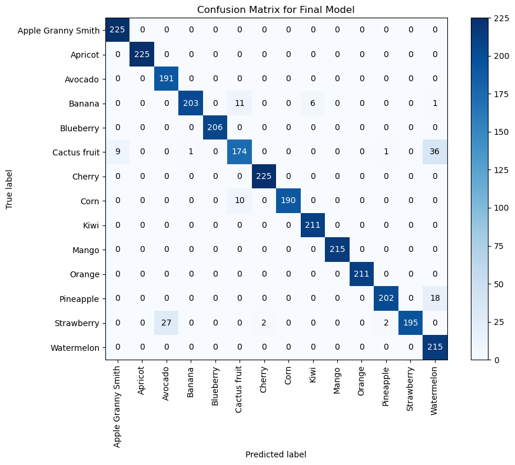
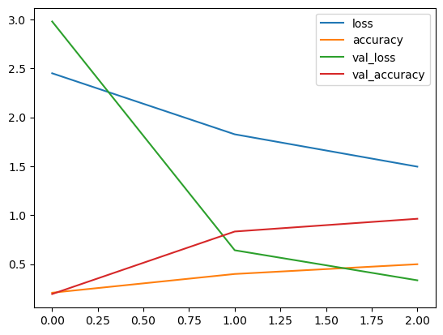

# README edits to apply immediately

## Replace weak signals
Change notebook-only wording into engineering wording.

### Old mindset
- assignment
- section 7
- section 9
- assessment
- what I did for class

### Better wording
- training pipeline
- evaluation workflow
- hyperparameter comparison
- deployment considerations
- final selected model

## Add visual proof
Insert this block under `## Final results` after you export images:

```md
## Visual results

### Confusion Matrix


### Training Curve


### Sample Predictions

```

## Add this short reproduction section

```md
## Reproduce locally

1. Create environment
2. Place dataset in `data/train` and `data/test`
3. Run training:
   python src/train.py --train_dir data/train --img_size 100 --batch_size 32 --epochs 20
4. Run single-image inference:
   python src/predict.py --image path/to/image.jpg --model model/fruit_classifier_final_best_model.keras
```
